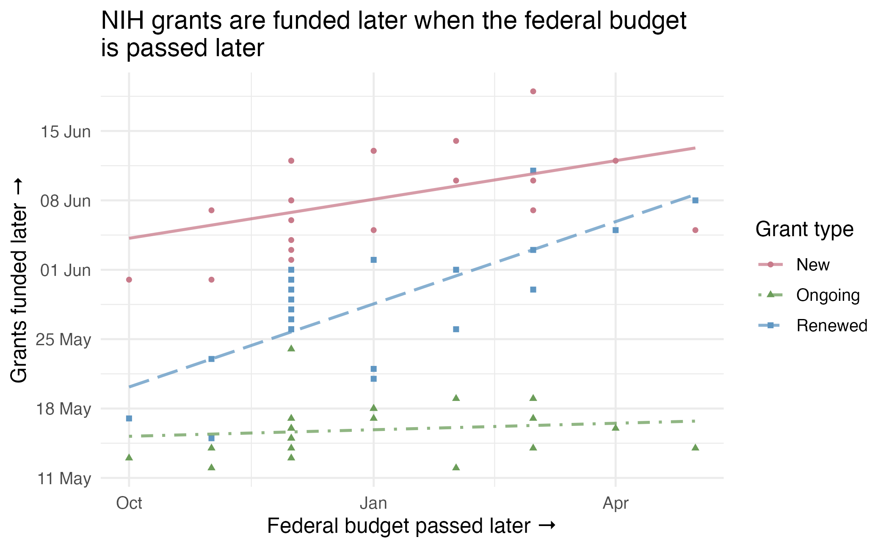
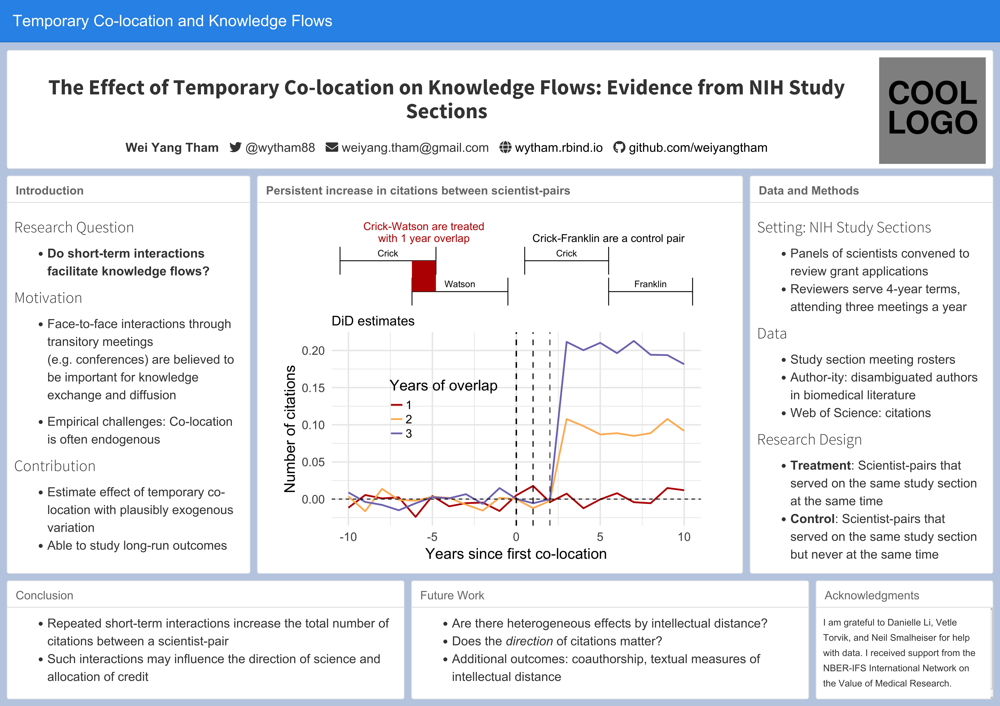

Some dataviz examples from my work:

- Graph on the relationship between resolution of the federal budget and timing of NIH grant disbursement (see below)
- Poster for project on effect of in-person interactions on knowledge flows (see below)
- [Slides for project on effect of funding delays on the scientific labor force](https://majestic-nasturtium-1a6e67.netlify.app/#34)

